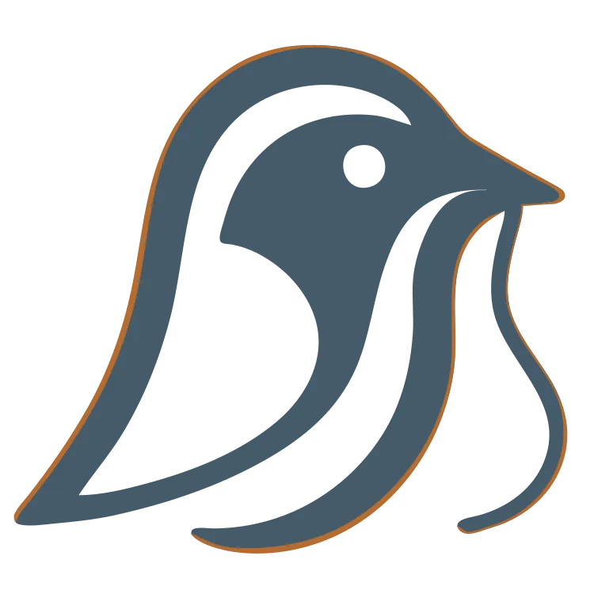

<!--
SPDX-FileCopyrightText: 2025 Knitli Inc.
SPDX-FileContributor: Adam Poulemanos <adam@knit.li>

SPDX-License-Identifier: MIT OR Apache-2.0
-->

<div align="center">

<picture>
  <source media="(prefers-color-scheme: dark)" srcset="docs/assets/codeweaver-reverse.webp">
  <source media="(prefers-color-scheme: light)" srcset="docs/assets/codeweaver-primary.webp">
  
</picture>

# CodeWeaver Alpha 6

### Exquisite Context for Agents — Infrastructure that is Extensible, Predictable, and Resilient.

[![Python Version][badge_python]][link_python]
[![License][badge_license]][link_license]
[![Alpha Release][badge_release]][link_release]
[![MCP Compatible][badge_mcp]][link_mcp]

[Documentation][nav_docs] •
[Installation][nav_install] •
[Features][nav_features] •
[Comparison][nav_comparison]

</div>

---

## What It Does

**CodeWeaver gives Claude and other AI agents precise context from your codebase.** Not keyword grep. Not whole-file dumps. Actual structural understanding through hybrid semantic search.

CodeWeaver Alpha 6 transforms from a "Search Tool" into **Professional Context Infrastructure**. With 100% Dependency Injection (DI) and a Pydantic-driven configuration system, it provides the reliability and extensibility required for industrial-grade AI deployments.

**Example:**
```
Without CodeWeaver:
  Claude: "Let me search for 'auth'... here are 50 files mentioning authentication"
  Result: Generic code, wrong context, wasted tokens

With CodeWeaver:
  You: "Where do we validate OAuth tokens?"
  Claude gets: The exact 3 functions across 2 files, with surrounding context
  Result: Precise answers, focused context, 60-80% token reduction
```

> ⚠️ **Alpha Release**: CodeWeaver is in active development. [Use it, break it, help shape it][issues].

---

## How CodeWeaver Stacks Up

### Quick Reference Matrix

| Feature | CodeWeaver Alpha 6 | Legacy Search Tools |
| :--- | :--- | :--- |
| **Search Type** | Hybrid (Semantic + AST + Keyword) | Keyword Only |
| **Context Quality** | **Exquisite** / High-Precision | Noisy / Irrelevant |
| **Extensibility** | **DI-Driven** (Zero-Code Provider Swap) | Hardcoded |
| **Reliability** | **Resilient** (Automatic Local Fallback) | Fails on API Timeout |
| **Token Usage** | **Optimized** (60–80% Reduction) | Wasted on Noise |

📊 [See detailed competitive analysis →][competitive_analysis]

---

## 🚀 Getting Started

### Quick Install

Using the [CLI](#cli) with [uv][uv_tool]:
```bash
# Add CodeWeaver to your project
uv add code-weaver

# Initialize with a profile (recommended uses Voyage AI)
cw init --profile recommended

# Verify setup
cw doctor

# Start the background daemon
cw start
```

> **📝 Note**: `cw init` supports different **Profiles**:
> - `recommended`: High-precision search (Voyage AI + Qdrant)
> - `quickstart`: 100% local, private, and free (FastEmbed + Local Qdrant)
>
> **Want full offline?** See the [Local-Only Guide][nav_docs].

🐳 **Prefer Docker?** [See Docker setup guide →][docker_guide]

---

## ✨ Features

<table>
<tr>
<td width="50%">

### 🔍 Exquisite Context
- **Hybrid search** (sparse + dense vectors)
- **AST-level understanding** (27 languages)
- **Reciprocal Rank Fusion (RRF)**
- **Language-aware chunking** (166+ languages)

</td>
<td width="50%">

### 🛡️ Industrial Resilience
- **Automatic local fallback** (FastEmbed)
- **Circuit breaker pattern** for APIs
- **Works airgapped** (no cloud required)
- **Pydantic-driven validation** at boot-time

</td>
</tr>
<tr>
<td>

### 🧩 Universal Extensibility
- **100% DI-driven architecture**
- **17+ integrated providers**
- **Custom provider API**
- **Zero-code provider swapping**

</td>
<td>

### 🛠️ Developer Experience
- **Live indexing** with file watching
- **Diagnostic tool** (`cw doctor`)
- **Multiple CLI aliases** (`cw` / `codeweaver`)
- **Selectable profiles** for easy setup

</td>
</tr>
</table>

---

## 💭 Philosophy: Context is Oxygen

AI agents face **too much irrelevant context**, causing token waste, missed patterns, and hallucinations. CodeWeaver addresses this with one focused capability: **structural + semantic code understanding that you control.**

- **Curation over Collection:** Give agents exactly what they need, nothing more.
- **Privacy-First:** Your code stays local if you want it to.
- **Infrastructure over Tooling:** Built to be the reliable foundation for your AI stack.

📖 [Read the detailed rationale →][why_codeweaver]

---
<div align="center">

**Official Documentation: [docs.knitli.com/codeweaver/](https://docs.knitli.com/codeweaver/)**

**Built with ❤️ by [Knitli][knitli_site]**

[⬆ Back to top][nav_top]

</div>

<!-- Badges -->

[badge_license]: <https://img.shields.io/badge/license-MIT%20OR%20Apache--2.0-green.svg> "License Badge"
[badge_mcp]: <https://img.shields.io/badge/MCP-compatible-purple.svg> "MCP Compatible Badge"
[badge_python]: <https://img.shields.io/badge/python-3.12%2B-blue.svg> "Python Version Badge"
[badge_release]: <https://img.shields.io/badge/release-alpha%205-orange.svg> "Release Badge"

<!-- Other links -->

[api_find_code]: <src/codeweaver/agent_api/find_code/README.md> "find_code API Documentation"
[arch_find_code]: <src/codeweaver/agent_api/find_code/ARCHITECTURE.md> "find_code Architecture"
[architecture]: <ARCHITECTURE.md> "Overall Architecture"
[bashandbone]: <https://github.com/bashandbone> "Adam Poulemanos' GitHub Profile"
[competitive_analysis]: <src/codeweaver/docs/comparison.md> "See how CodeWeaver stacks up"
[changelog]: <https://github.com/knitli/codeweaver/blob/main/CHANGELOG.md> "Changelog"
[cla]: <CONTRIBUTORS_LICENSE_AGREEMENT.md> "Contributor License Agreement"
[cli_guide]: <docs/CLI.md> "Command Line Reference"
[config_schema]: <schema/codeweaver.schema.json> "The CodeWeaver Config Schema"
[docker_guide]: <DOCKER.md> "Docker Setup Guide"
[docker_notes]: <docs/docker/DOCKER_BUILD_NOTES.md> "Docker Build Notes"
[enhancement_label]: <https://github.com/knitli/codeweaver/labels/enhancement> "Enhancement Issues"
[issues]: <https://github.com/knitli/codeweaver/issues> "Report an Issue"
[knitli_blog]: <https://blog.knitli.com> "Knitli Blog"
[knitli_github]: <https://github.com/knitli> "Knitli GitHub Organization"
[knitli_linkedin]: <https://linkedin.com/company/knitli> "Knitli LinkedIn"
[knitli_site]: <https://knitli.com> "Knitli Website"
[knitli_x]: <https://x.com/knitli_inc> "Knitli X/Twitter"
[link_license]: <LICENSE> "License File"
[link_mcp]: <https://modelcontextprotocol.io> "Model Context Protocol Website"
[link_python]: <https://www.python.org/downloads/> "Python Downloads"
[link_release]: <https://github.com/knitli/codeweaver/releases> "CodeWeaver Releases"
[mcp]: <https://modelcontextprotocol.io> "Learn About the Model Context Protocol"
[nav_contributing]: <#-contributing> "Contributing Section"
[nav_docs]: <#-documentation> "Documentation Section"
[nav_comparison]: <#-quick_reference_matrix> "How CodeWeaver Compares"
[nav_features]: <#-features> "Features Section"
[nav_how_it_works]: <#-how-it-works> "How It Works Section"
[nav_install]: <#-getting-started> "Installation Section"
[nav_top]: <#codeweaver> "Back to Top"
[privacy_policy]: <PRIVACY_POLICY.md> "Privacy Policy"
[product_decisions]: <PRODUCT.md> "Product Decisions"
[providers_list]: <overrides/partials/providers.md> "Full Provider List"
[qdrant]: <https://qdrant.tech> "Qdrant Website"
[repo]: <https://github.com/knitli/codeweaver> "CodeWeaver Repository"
[reuse_spec]: <https://reuse.software> "REUSE Specification"
[sbom]: <sbom.spdx> "Software Bill of Materials"
[sponsor]: <https://github.com/sponsors/knitli> "Sponsor Knitli"
[telemetry_impl]: <src/codeweaver/common/telemetry/> "Telemetry Implementation"
[telemetry_readme]: <src/codeweaver/common/telemetry/README.md> "Telemetry README"
[uv_tool]: <https://astral.sh/uv> "uv Package Manager"
[voyage_ai]: <http://voyage.ai> "Voyage AI Website"
[why_codeweaver]: <docs/WHY.md> "Why CodeWeaver"
[wiki_ast]: <https://en.wikipedia.org/wiki/Abstract_syntax_tree> "About Abstract Syntax Trees"
