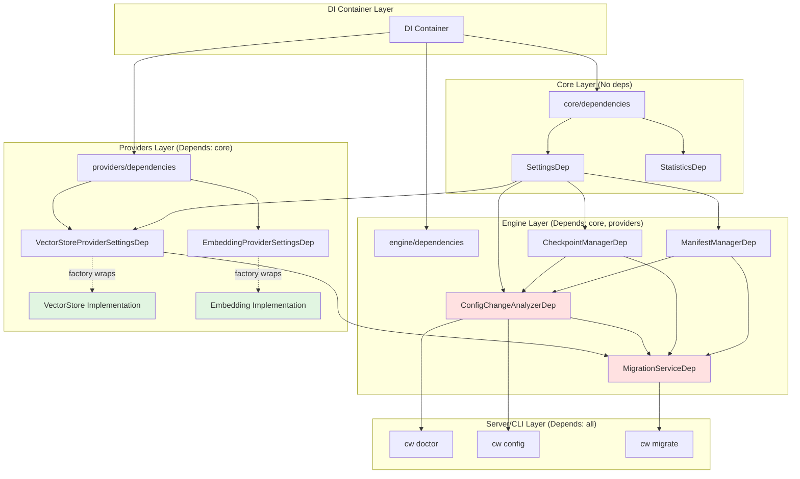

<!--
SPDX-FileCopyrightText: 2026 Knitli Inc.
SPDX-FileContributor: Adam Poulemanos <adam@knit.li>

SPDX-License-Identifier: MIT OR Apache-2.0
-->

# Corrected DI Architecture for Migration System

**Version**: 2.1 (Architecture-Corrected)
**Date**: 2026-02-12

## Critical Architectural Corrections

Based on comprehensive DI analysis, the migration system architecture needs significant corrections:

### 1. Service Location: Engine, Not Providers

**Wrong** (original plan):
```
providers/vector_stores/
├── config_analyzer.py
├── migration_service.py
└── dependencies.py
```

**Correct**:
```
engine/
├── services/
│   ├── config_analyzer.py       # NEW
│   └── migration_service.py     # NEW
├── managers/
│   ├── checkpoint_manager.py    # EXISTING
│   └── manifest_manager.py      # EXISTING
└── dependencies.py               # UPDATE with new service factories
```

**Rationale**:
- Migration is **pipeline machinery**, not a pluggable provider
- Engine owns indexing, chunking, checkpointing → also owns migration
- Keeps `providers` package architecture-agnostic
- Respects package separation for future installability

---

## 2. Package Dependency Structure

```
Package Dependency Flow (Unidirectional):

core/                    (NO external codeweaver deps)
├── di/                 (DI container)
└── dependencies/       (Core services)

semantic/               (depends on: core)
providers/              (depends on: core)
├── embedding/          (Provider implementations - NO DI in classes)
├── vector_stores/      (Provider implementations - NO DI in classes)
├── reranking/
└── dependencies/       (Factory wrappers for providers)

engine/                 (depends on: core, semantic, providers)
├── services/           (Service implementations - NO DI in classes)
│   ├── chunking_service.py
│   ├── indexing_service.py
│   ├── config_analyzer.py      ← NEW (Phase 1)
│   └── migration_service.py    ← NEW (Phase 2)
├── managers/           (Manager implementations - NO DI in classes)
│   ├── checkpoint_manager.py
│   └── manifest_manager.py
└── dependencies.py     (Factory functions WITH DI)

server/                 (depends on: all above)
cli/                    (depends on: all above)
```

**Key Rules**:
1. Services/managers/providers are **plain classes** - no DI in signatures
2. Factory functions in `dependencies.py` modules handle DI integration
3. Factories use `= INJECTED` parameters, services don't
4. Package dependencies flow upward only

---

## 3. Correct DI Pattern: Factory Wrappers

### Pattern: Service WITHOUT DI in Constructor

```python
# engine/services/config_analyzer.py
class ConfigChangeAnalyzer:
    """Analyzes configuration changes - PLAIN CLASS."""

    def __init__(
        self,
        settings: Settings,                    # NO DI markers
        checkpoint_manager: CheckpointManager,  # NO DI markers
        manifest_manager: ManifestManager,      # NO DI markers
    ) -> None:
        self.settings = settings
        self.checkpoint_manager = checkpoint_manager
        self.manifest_manager = manifest_manager

    async def analyze_config_change(self, ...) -> ConfigChangeAnalysis:
        # Service logic here
        ...

# Can be instantiated directly without DI:
analyzer = ConfigChangeAnalyzer(
    settings=my_settings,
    checkpoint_manager=my_checkpoint_manager,
    manifest_manager=my_manifest_manager,
)
```

### Pattern: Factory WITH DI Integration

```python
# engine/dependencies.py
from codeweaver.core.di import dependency_provider, depends, INJECTED
from typing import Annotated

from codeweaver.core.dependencies import SettingsDep
from codeweaver.engine.managers.checkpoint_manager import CheckpointManager
from codeweaver.engine.services.config_analyzer import ConfigChangeAnalyzer

# Factory function wraps service with DI
@dependency_provider(ConfigChangeAnalyzer, scope="singleton")
def _create_config_analyzer(
    settings: SettingsDep = INJECTED,              # DI HERE
    checkpoint_manager: CheckpointManagerDep = INJECTED,  # DI HERE
    manifest_manager: ManifestManagerDep = INJECTED,      # DI HERE
) -> ConfigChangeAnalyzer:
    """Factory wraps service instantiation."""
    # Factory receives dependencies via DI, passes to service
    return ConfigChangeAnalyzer(
        settings=settings,
        checkpoint_manager=checkpoint_manager,
        manifest_manager=manifest_manager,
    )

# Type alias for injection
type ConfigChangeAnalyzerDep = Annotated[
    ConfigChangeAnalyzer,
    depends(_create_config_analyzer, scope="singleton"),
]
```

### Pattern: Using Service in CLI

```python
# cli/commands/doctor.py
from codeweaver.core.di import INJECTED
from codeweaver.engine.dependencies import ConfigChangeAnalyzerDep

async def check_embedding_compatibility(
    config_analyzer: ConfigChangeAnalyzerDep = INJECTED,  # DI injects here
) -> DoctorCheck:
    """CLI command receives service via DI."""
    # Service is automatically injected by container
    analysis = await config_analyzer.analyze_current_config()
    ...
```

---

## 4. Service Architecture Diagram



**Legend**:
- Green boxes: Provider implementations (no DI in class)
- Red boxes: New migration services (no DI in class)
- Arrows: Dependency flow (via DI factories)

---

## 5. Existing Services (Already DI-Registered)

### Engine Managers (engine/managers/)

**CheckpointManager**:
```python
# Existing registration in engine/dependencies.py (lines 112-123)
@dependency_provider(CheckpointManager, scope="singleton")
def _create_checkpoint_manager(
    project_path: ResolvedProjectPathDep = INJECTED,
    settings: IndexerSettingsDep = INJECTED,
    project_name: ResolvedProjectNameDep = INJECTED,
) -> CheckpointManager:
    return CheckpointManager(
        project_path=project_path,
        checkpoint_dir=settings.checkpoint_dir,
        project_name=project_name,
    )

type CheckpointManagerDep = Annotated[
    CheckpointManager, depends(_create_checkpoint_manager, scope="singleton")
]
```

**ManifestManager**:
```python
# Existing registration in engine/dependencies.py (lines 126-137)
@dependency_provider(FileManifestManager, scope="singleton")
def _create_manifest_manager(
    project_path: ResolvedProjectPathDep = INJECTED,
    settings: IndexerSettingsDep = INJECTED,
) -> FileManifestManager:
    return FileManifestManager(
        project_path=project_path,
        manifest_path=settings.manifest_path,
    )

type ManifestManagerDep = Annotated[
    FileManifestManager, depends(_create_manifest_manager, scope="singleton")
]
```

---

## 6. New Services Architecture

### Phase 1: Configuration Analysis

**Service Class** (engine/services/config_analyzer.py):
```python
from codeweaver.config.settings import Settings
from codeweaver.engine.managers.checkpoint_manager import CheckpointManager
from codeweaver.engine.managers.manifest_manager import FileManifestManager

class ConfigChangeAnalyzer:
    """Analyzes configuration changes for compatibility."""

    def __init__(
        self,
        settings: Settings,
        checkpoint_manager: CheckpointManager,
        manifest_manager: FileManifestManager,
    ) -> None:
        """Initialize analyzer with dependencies (NO DI markers)."""
        self.settings = settings
        self.checkpoint_manager = checkpoint_manager
        self.manifest_manager = manifest_manager

    async def analyze_config_change(
        self,
        old_meta: CollectionMetadata,
        new_config: EmbeddingConfig,
    ) -> ConfigChangeAnalysis:
        """Analyze configuration change impact."""
        # Implementation here
        ...

    async def analyze_current_config(self) -> ConfigChangeAnalysis:
        """Analyze current config against existing collection."""
        # Get current collection metadata
        manifest = await self.manifest_manager.read_manifest()
        checkpoint = await self.checkpoint_manager.load_checkpoint()

        # Compare with current settings
        current_embedding = self.settings.provider.embedding

        return await self.analyze_config_change(
            old_meta=checkpoint.collection_metadata,
            new_config=current_embedding,
        )
```

**Factory Registration** (engine/dependencies.py):
```python
from codeweaver.engine.services.config_analyzer import ConfigChangeAnalyzer

@dependency_provider(ConfigChangeAnalyzer, scope="singleton")
def _create_config_analyzer(
    settings: SettingsDep = INJECTED,
    checkpoint_manager: CheckpointManagerDep = INJECTED,
    manifest_manager: ManifestManagerDep = INJECTED,
) -> ConfigChangeAnalyzer:
    """Factory for config analyzer with DI."""
    return ConfigChangeAnalyzer(
        settings=settings,
        checkpoint_manager=checkpoint_manager,
        manifest_manager=manifest_manager,
    )

type ConfigChangeAnalyzerDep = Annotated[
    ConfigChangeAnalyzer,
    depends(_create_config_analyzer, scope="singleton"),
]
```

### Phase 2: Migration Service

**Service Class** (engine/services/migration_service.py):
```python
from codeweaver.providers.vector_stores.base import VectorStoreProvider
from codeweaver.engine.services.config_analyzer import ConfigChangeAnalyzer
from codeweaver.engine.managers.checkpoint_manager import CheckpointManager
from codeweaver.engine.managers.manifest_manager import FileManifestManager

class MigrationService:
    """Handles collection migrations (dimension reduction, quantization)."""

    def __init__(
        self,
        vector_store: VectorStoreProvider,      # Provider instance (wrapped by DI)
        config_analyzer: ConfigChangeAnalyzer,
        checkpoint_manager: CheckpointManager,
        manifest_manager: FileManifestManager,
    ) -> None:
        """Initialize migration service (NO DI markers)."""
        self.vector_store = vector_store
        self.config_analyzer = config_analyzer
        self.checkpoint_manager = checkpoint_manager
        self.manifest_manager = manifest_manager

    async def migrate_dimensions(
        self,
        target_dimension: int,
    ) -> MigrationResult:
        """Migrate collection to new dimension."""
        # Implementation here
        ...
```

**Factory Registration** (engine/dependencies.py):
```python
from codeweaver.engine.services.migration_service import MigrationService
from codeweaver.providers.dependencies import VectorStoreProviderDep

@dependency_provider(MigrationService, scope="singleton")
async def _create_migration_service(
    vector_store: VectorStoreProviderDep = INJECTED,        # Provider wrapped by DI
    config_analyzer: ConfigChangeAnalyzerDep = INJECTED,
    checkpoint_manager: CheckpointManagerDep = INJECTED,
    manifest_manager: ManifestManagerDep = INJECTED,
) -> MigrationService:
    """Factory for migration service with DI."""
    return MigrationService(
        vector_store=vector_store,
        config_analyzer=config_analyzer,
        checkpoint_manager=checkpoint_manager,
        manifest_manager=manifest_manager,
    )

type MigrationServiceDep = Annotated[
    MigrationService,
    depends(_create_migration_service, scope="singleton"),
]
```

---

## 7. CLI Integration (Correct Pattern)

### Doctor Command

```python
# cli/commands/doctor.py
from codeweaver.core.di import INJECTED
from codeweaver.engine.dependencies import ConfigChangeAnalyzerDep

async def check_embedding_compatibility(
    config_analyzer: ConfigChangeAnalyzerDep = INJECTED,  # DI injection
) -> DoctorCheck:
    """Check compatibility using DI-injected analyzer."""
    try:
        # Service automatically injected, no manual construction
        analysis = await config_analyzer.analyze_current_config()

        match analysis.impact:
            case ChangeImpact.NONE:
                return DoctorCheck.success(...)
            case ChangeImpact.COMPATIBLE:
                return DoctorCheck.success(...)
            case ChangeImpact.TRANSFORMABLE:
                return DoctorCheck.warn(...)
            case ChangeImpact.BREAKING:
                return DoctorCheck.fail(...)
    except Exception as e:
        return DoctorCheck.fail(str(e))
```

### Config Set Command

```python
# cli/commands/config.py
from codeweaver.core.di import INJECTED
from codeweaver.core.dependencies import SettingsDep
from codeweaver.engine.dependencies import ConfigChangeAnalyzerDep

@app.command()
async def set_config(
    key: str,
    value: str,
    force: bool = False,
    config_analyzer: ConfigChangeAnalyzerDep = INJECTED,  # DI injection
    settings: SettingsDep = INJECTED,                     # DI injection
):
    """Set configuration with proactive validation."""

    if not force:
        # Analyze impact before applying
        analysis = await config_analyzer.analyze_config_change(
            old_meta=await get_current_collection_metadata(),
            new_config=simulate_config_change(settings, key, value),
        )

        if analysis.impact == ChangeImpact.BREAKING:
            display_breaking_change_warning(analysis)
            if not Confirm.ask("Continue?"):
                return

    # Apply change
    await settings.set(key, value)
```

---

## 8. Testing Patterns (Corrected)

### Unit Tests: Mock Dependencies

```python
# tests/engine/services/test_config_analyzer.py
import pytest
from unittest.mock import Mock, AsyncMock

from codeweaver.config.settings import Settings
from codeweaver.engine.services.config_analyzer import ConfigChangeAnalyzer

@pytest.fixture
def mock_checkpoint_manager():
    """Mock checkpoint manager."""
    manager = Mock()
    manager.load_checkpoint = AsyncMock()
    return manager

@pytest.fixture
def mock_manifest_manager():
    """Mock manifest manager."""
    manager = Mock()
    manager.read_manifest = AsyncMock()
    return manager

@pytest.fixture
def config_analyzer(mock_checkpoint_manager, mock_manifest_manager):
    """Create analyzer with mocked dependencies."""
    settings = Settings()  # Test settings

    # Direct instantiation (NO DI needed for unit tests)
    return ConfigChangeAnalyzer(
        settings=settings,
        checkpoint_manager=mock_checkpoint_manager,
        manifest_manager=mock_manifest_manager,
    )

async def test_analyze_config_change(config_analyzer):
    """Test configuration analysis."""
    analysis = await config_analyzer.analyze_config_change(
        old_meta=create_test_metadata(),
        new_config=create_test_config(),
    )

    assert analysis.impact == ChangeImpact.COMPATIBLE
```

### Integration Tests: Use DI Container

```python
# tests/integration/test_migration_flow.py
import pytest
from codeweaver.core.di import get_container, clear_container, dependency_provider
from codeweaver.engine.dependencies import (
    ConfigChangeAnalyzerDep,
    MigrationServiceDep,
)

@pytest.fixture
def test_container():
    """Create test container with real services."""
    clear_container()
    container = get_container()

    # Override with test settings
    @dependency_provider(Settings)
    def _test_settings() -> Settings:
        return Settings(vector_store="inmemory")  # Use in-memory for tests

    yield container
    clear_container()

async def test_full_migration_flow(test_container):
    """Test complete migration with DI services."""
    # Resolve real services (not mocked)
    config_analyzer = await test_container.resolve(ConfigChangeAnalyzerDep)
    migration_service = await test_container.resolve(MigrationServiceDep)

    # Run real migration
    analysis = await config_analyzer.analyze_current_config()
    result = await migration_service.migrate_dimensions(target_dimension=768)

    assert result.vectors_migrated > 0
```

---

## 9. Package Separation Benefits

### How This Architecture Supports Future Separation

```python
# Example: Using providers without engine

# Install: pip install codeweaver-providers
from codeweaver.providers.vector_stores.qdrant import QdrantVectorStore
from codeweaver.providers.embedding.providers.fastembed import FastEmbedProvider

# Direct instantiation (no DI, no engine)
vector_store = QdrantVectorStore(
    url="http://localhost:6333",
    collection_name="my_collection",
)

embedding_provider = FastEmbedProvider(
    model_name="BAAI/bge-small-en-v1.5",
)

# Use providers standalone
embeddings = await embedding_provider.embed_documents(["hello", "world"])
await vector_store.upsert(embeddings)
```

```python
# Example: Using engine with providers

# Install: pip install codeweaver-engine codeweaver-providers
from codeweaver.core.di import get_container
from codeweaver.engine.dependencies import IndexingServiceDep

# DI wires everything together
container = get_container()
indexing_service = await container.resolve(IndexingServiceDep)

# Engine orchestrates providers
await indexing_service.index_codebase(path="/path/to/code")
```

**Result**: Clean separation enables:
- Using providers in other frameworks
- Testing providers independently
- Publishing packages separately
- Gradual adoption (core → providers → engine → server)

---

## 10. Summary of Corrections

| Aspect | Original (Wrong) | Corrected |
|--------|------------------|-----------|
| **Service Location** | `providers/vector_stores/` | `engine/services/` |
| **Service Signatures** | Had `= INJECTED` in __init__ | Plain parameters, no DI |
| **DI Integration** | Services decorated with @dependency_provider | Factory functions decorated |
| **Factory Location** | `providers/vector_stores/dependencies.py` | `engine/dependencies.py` |
| **Package Boundaries** | Mixed engine/provider concerns | Clean separation maintained |
| **Testing** | DI container required | Direct instantiation possible |
| **Installability** | Would couple packages | Maintains separation |

---

## 11. Implementation Checklist (Corrected)

### Phase 1: Configuration Analysis

- [ ] Create `engine/services/config_analyzer.py` (plain class, no DI)
- [ ] Add factory in `engine/dependencies.py` with `@dependency_provider`
- [ ] Define `ConfigChangeAnalyzerDep` type alias
- [ ] Export in `engine/__init__.py`
- [ ] Update `cli/commands/doctor.py` to use `= INJECTED` parameter
- [ ] Update `cli/commands/config.py` to use `= INJECTED` parameter
- [ ] Write unit tests with mocked dependencies (direct instantiation)
- [ ] Write integration tests with DI container

### Phase 2: Migration Service

- [ ] Create `engine/services/migration_service.py` (plain class, no DI)
- [ ] Add factory in `engine/dependencies.py` with `@dependency_provider`
- [ ] Define `MigrationServiceDep` type alias
- [ ] Export in `engine/__init__.py`
- [ ] Create `cli/commands/migrate.py` with `= INJECTED` parameters
- [ ] Write unit tests with mocked dependencies
- [ ] Write integration tests with DI container

---

## References

- **DI Analysis**: Agent analysis of existing DI architecture (ad54527)
- **Package Structure**: `core/`, `providers/`, `engine/`, `server/` top-level packages
- **Existing Registrations**: `engine/dependencies.py` lines 112-250
- **DI Container**: `core/di/container.py`
- **Provider Pattern**: Providers wrapped by factories, not DI-injected directly
