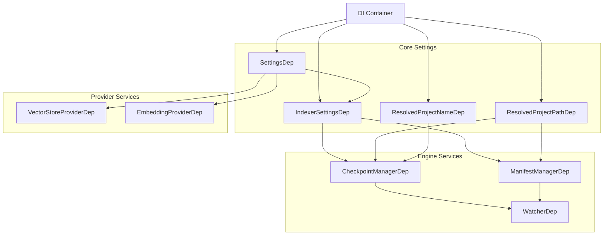
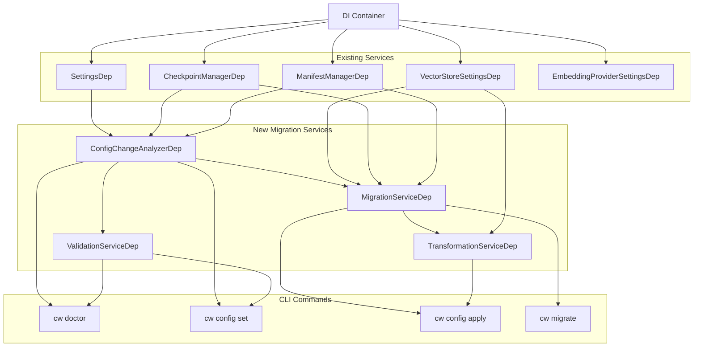

<!--
SPDX-FileCopyrightText: 2026 Knitli Inc.
SPDX-FileContributor: Adam Poulemanos <adam@knit.li>

SPDX-License-Identifier: MIT OR Apache-2.0
-->

# Dependency Injection Architecture for Migration System

**Version**: 1.0
**Date**: 2026-02-12

## Overview

CodeWeaver uses a FastAPI-inspired dependency injection system implemented in `codeweaver.core.di`. This document shows how the migration system integrates with the existing DI infrastructure.

## Core DI Concepts

### 1. Service Registration Pattern

Services are registered using the `@dependency_provider` decorator:

```python
from codeweaver.core.di import dependency_provider, depends, INJECTED
from typing import Annotated

@dependency_provider(ServiceClass, scope="singleton")
def _create_service(
    dependency1: Dependency1Dep = INJECTED,
    dependency2: Dependency2Dep = INJECTED,
) -> ServiceClass:
    """Factory function for ServiceClass."""
    return ServiceClass(dependency1, dependency2)

# Type alias for injection
type ServiceClassDep = Annotated[
    ServiceClass,
    depends(_create_service, scope="singleton")
]
```

### 2. Dependency Resolution

The DI container resolves dependencies automatically:

```python
from codeweaver.core.di import get_container

# Automatic resolution
async def my_function(service: ServiceClassDep = INJECTED) -> None:
    # service is automatically injected
    ...

# Manual resolution
container = get_container()
service = await container.resolve(ServiceClassDep)
```

### 3. Scope Management

- **singleton**: One instance per container (default for services)
- **transient**: New instance per resolution
- **request**: One instance per request (for web contexts)

---

## Existing Service Architecture

### Core Services (Already Registered)



---

## New Migration System Architecture

### Service Dependency Graph



### Service Definitions

#### 1. ConfigChangeAnalyzer

**Location**: `codeweaver.providers.vector_stores.dependencies`

```python
@dependency_provider(ConfigChangeAnalyzer, scope="singleton")
def _create_config_analyzer(
    settings: SettingsDep = INJECTED,
    checkpoint_manager: CheckpointManagerDep = INJECTED,
    manifest_manager: ManifestManagerDep = INJECTED,
) -> ConfigChangeAnalyzer:
    """Create configuration change analyzer."""
    return ConfigChangeAnalyzer(
        settings=settings,
        checkpoint_manager=checkpoint_manager,
        manifest_manager=manifest_manager,
    )

type ConfigChangeAnalyzerDep = Annotated[
    ConfigChangeAnalyzer,
    depends(_create_config_analyzer, scope="singleton")
]
```

**Responsibilities**:
- Analyze configuration changes
- Classify change impact (NONE, COMPATIBLE, TRANSFORMABLE, BREAKING)
- Calculate transformation estimates
- Family-aware compatibility validation

---

#### 2. MigrationService

**Location**: `codeweaver.providers.vector_stores.dependencies`

```python
@dependency_provider(MigrationService, scope="singleton")
def _create_migration_service(
    vector_store_settings: VectorStoreProviderSettingsDep = INJECTED,
    config_analyzer: ConfigChangeAnalyzerDep = INJECTED,
    checkpoint_manager: CheckpointManagerDep = INJECTED,
    manifest_manager: ManifestManagerDep = INJECTED,
) -> MigrationService:
    """Create migration service."""
    # Resolve vector store client from settings
    client = vector_store_settings.get_client()

    return MigrationService(
        client=client,
        config_analyzer=config_analyzer,
        checkpoint_manager=checkpoint_manager,
        manifest_manager=manifest_manager,
    )

type MigrationServiceDep = Annotated[
    MigrationService,
    depends(_create_migration_service, scope="singleton")
]
```

**Responsibilities**:
- Blue-green collection migration
- Dimension reduction with truncation
- Rollback management
- Migration validation

---

#### 3. TransformationService

**Location**: `codeweaver.providers.vector_stores.dependencies`

```python
@dependency_provider(TransformationService, scope="singleton")
def _create_transformation_service(
    vector_store_settings: VectorStoreProviderSettingsDep = INJECTED,
    migration_service: MigrationServiceDep = INJECTED,
) -> TransformationService:
    """Create transformation service."""
    client = vector_store_settings.get_client()

    return TransformationService(
        client=client,
        migration_service=migration_service,
    )

type TransformationServiceDep = Annotated[
    TransformationService,
    depends(_create_transformation_service, scope="singleton")
]
```

**Responsibilities**:
- Quantization transformations
- Dimension reduction orchestration
- Metadata updates
- Transformation tracking

---

#### 4. ValidationService

**Location**: `codeweaver.providers.vector_stores.dependencies`

```python
@dependency_provider(ValidationService, scope="singleton")
def _create_validation_service(
    config_analyzer: ConfigChangeAnalyzerDep = INJECTED,
    vector_store_settings: VectorStoreProviderSettingsDep = INJECTED,
) -> ValidationService:
    """Create validation service."""
    client = vector_store_settings.get_client()

    return ValidationService(
        config_analyzer=config_analyzer,
        client=client,
    )

type ValidationServiceDep = Annotated[
    ValidationService,
    depends(_create_validation_service, scope="singleton")
]
```

**Responsibilities**:
- Proactive configuration validation
- Migration integrity verification
- Search quality validation
- Data integrity checks

---

## Integration Points

### CLI Command Integration

Commands receive services through DI:

```python
# In codeweaver/cli/commands/doctor.py
async def check_embedding_compatibility(
    config_analyzer: ConfigChangeAnalyzerDep = INJECTED,
    validation_service: ValidationServiceDep = INJECTED,
) -> DoctorCheck:
    """Check embedding compatibility."""
    # Services automatically injected
    analysis = await config_analyzer.analyze_current_config()
    ...
```

### Settings Integration

Services access settings through DI:

```python
# In ConfigChangeAnalyzer
class ConfigChangeAnalyzer:
    def __init__(
        self,
        settings: SettingsDep,
        checkpoint_manager: CheckpointManager,
        manifest_manager: ManifestManager,
    ):
        self.settings = settings
        self.checkpoint_manager = checkpoint_manager
        self.manifest_manager = manifest_manager
```

---

## Service Lifecycle

### 1. Startup

```python
# Container initialized in codeweaver.core.di
from codeweaver.core.di import get_container

container = get_container()

# Services registered in their respective dependencies modules
# - codeweaver.core.dependencies (core services)
# - codeweaver.engine.dependencies (engine services)
# - codeweaver.providers.vector_stores.dependencies (migration services)
```

### 2. Resolution

```python
# Automatic resolution in functions
async def my_command(service: ServiceDep = INJECTED) -> None:
    # Container resolves ServiceDep automatically
    ...

# Manual resolution
service = await container.resolve(ServiceDep)
```

### 3. Singleton Management

```python
# First resolution creates instance
service1 = await container.resolve(MigrationServiceDep)

# Second resolution returns same instance
service2 = await container.resolve(MigrationServiceDep)

assert service1 is service2  # Same instance
```

---

## Testing with DI

### Unit Tests

Mock dependencies by providing test factories:

```python
from codeweaver.core.di import dependency_provider, clear_container

@pytest.fixture
def test_container():
    """Create test container with mocks."""
    clear_container()

    @dependency_provider(CheckpointManager, scope="singleton")
    def _mock_checkpoint_manager() -> CheckpointManager:
        return MockCheckpointManager()

    yield get_container()
    clear_container()

async def test_migration_service(test_container):
    """Test with mocked dependencies."""
    service = await test_container.resolve(MigrationServiceDep)
    # service has mock checkpoint manager
    ...
```

### Integration Tests

Use real services with test settings:

```python
@pytest.fixture
def test_settings():
    """Provide test settings."""
    return SettingsFactory.create_test_settings()

async def test_migration_flow(test_settings):
    """Test with real DI services."""
    container = get_container()

    # Override settings
    @dependency_provider(Settings)
    def _test_settings() -> Settings:
        return test_settings

    # Get real services
    migration_service = await container.resolve(MigrationServiceDep)
    ...
```

---

## File Organization

### Location Strategy

Migration services co-located with vector store code:

```
src/codeweaver/providers/vector_stores/
├── __init__.py
├── base.py
├── qdrant.py
├── qdrant_base.py
├── inmemory.py
├── dependencies.py          # NEW: Migration service registrations
├── config_analyzer.py       # NEW
├── migration_service.py     # NEW
├── transformation_service.py # NEW
└── validation_service.py    # NEW
```

**Rationale**:
- Services tightly coupled to vector store operations
- Easy to find related functionality
- Consistent with existing `codeweaver.engine.dependencies` pattern

---

## Benefits of DI Architecture

### 1. Testability
- Easy to mock dependencies
- Isolated unit testing
- Integration testing with real services

### 2. Maintainability
- Clear dependency graph
- Explicit service contracts
- Single responsibility per service

### 3. Flexibility
- Easy to swap implementations
- Configuration-driven behavior
- Runtime dependency resolution

### 4. Type Safety
- Type-checked dependencies
- IDE autocomplete support
- Compile-time error detection

---

## Common Patterns

### Pattern 1: Service Composition

```python
# High-level service composes lower-level services
@dependency_provider(MigrationOrchestrator, scope="singleton")
def _create_orchestrator(
    migration_service: MigrationServiceDep = INJECTED,
    transformation_service: TransformationServiceDep = INJECTED,
    validation_service: ValidationServiceDep = INJECTED,
) -> MigrationOrchestrator:
    return MigrationOrchestrator(
        migration=migration_service,
        transformation=transformation_service,
        validation=validation_service,
    )
```

### Pattern 2: Settings-Driven Factory

```python
# Service behavior configured from settings
@dependency_provider(VectorStoreClient, scope="singleton")
def _create_vector_store_client(
    settings: VectorStoreProviderSettingsDep = INJECTED,
) -> VectorStoreClient:
    # Factory creates client based on settings
    return settings.get_client()
```

### Pattern 3: Conditional Dependencies

```python
# Different implementations based on configuration
@dependency_provider(MigrationStrategy, scope="singleton")
def _create_migration_strategy(
    settings: SettingsDep = INJECTED,
) -> MigrationStrategy:
    if settings.migration.use_parallel:
        return ParallelMigrationStrategy()
    return SequentialMigrationStrategy()
```

---

## Migration Checklist

When adding new services:

- [ ] Define service class with clear interface
- [ ] Create factory function with `@dependency_provider`
- [ ] Define type alias with `Annotated[Type, depends(...)]`
- [ ] Register in appropriate `dependencies.py` module
- [ ] Export type alias in `__init__.py`
- [ ] Add to `__all__` tuple
- [ ] Write unit tests with mocked dependencies
- [ ] Write integration tests with real services
- [ ] Document service purpose and responsibilities
- [ ] Update this architecture diagram if needed

---

## Next Steps

1. **Implement Services**: Follow patterns above to implement migration services
2. **Register in DI**: Add to `codeweaver.providers.vector_stores.dependencies`
3. **Integrate CLI**: Update commands to use DI-injected services
4. **Test**: Unit tests with mocks, integration tests with real services
5. **Document**: Update API documentation with DI usage examples
